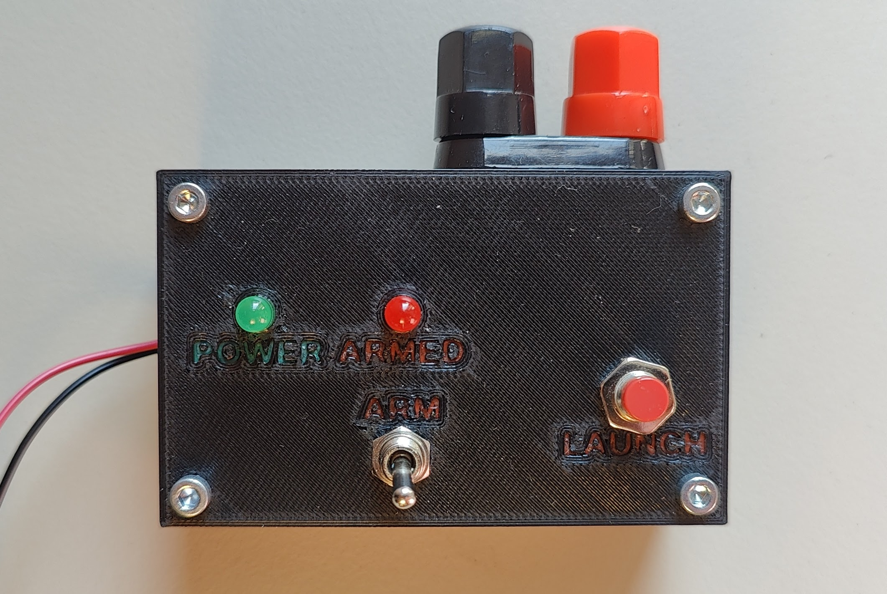

# Launch Controller 0

Simple switch-based model rocket launcher. When I say simple, I mean it!



Continuity checking? Yeah, sure, I'll tell you I've heard about it.

Keyed arm switch? Right, as if I had any keys laying around doing NOTHING.

I mean, frankly, the thing doesn't even have space for batteries in its enclosure.

On the other hand, its most complicated components is probably the LED telling
you the launcher is receiving power. (What, were you hoping for a switch?)

You can load a larger capacitor in there to fire a cluster of rockets with a 9 V
battery, and the 2 mm traces should withstand about anything.

## Building
First, clone this repository:
```sh
git clone https://github.com/mmalecki/lc-0
cd lc-0
git submodule update --init
```

1. Open the KiCAD project in the `electronics` directory. Get the PCB made (one-sided
is all that's needed here).
2. Render and 3D print the files in `enclosure`. 
